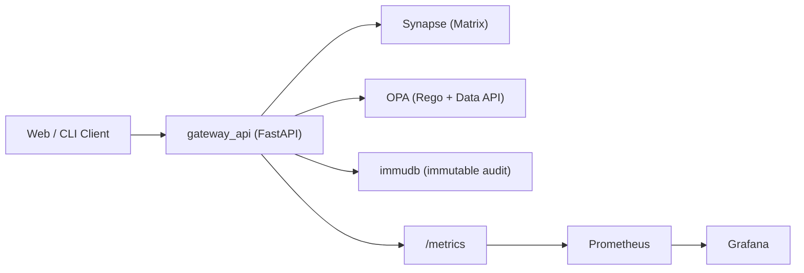

<div align="center">

# Prism
### AI-Native + Transparent-Security Messaging on Matrix
### 基于 Matrix 的 AI 原生透明安全消息系统

[](LICENSE)
[](https://www.python.org/)
[](https://matrix.org/)
[](docs/threat_model.md)

[English](#english) | [中文](#中文)

</div>

---

## English

## Overview

Prism is a runnable MVP for a "next-gen WeChat" direction:
- Matrix-native messaging
- AI agent as a first-class server-side actor
- security-by-default with immutable audit and revocable authorization

This project focuses on one closed loop first:  
`chat -> policy grant -> agent access -> revoke -> deny -> audit verification`.

## Why Prism

When AI is added to messaging, teams usually hit four problems:
- identity spoofing at API boundaries
- agent overreach (data reads without explicit consent)
- unprovable audit trails
- hard-to-debug policy and tool execution paths

Prism addresses them directly:
- **Gateway identity binding**: user identity is resolved from Matrix token (`whoami`) instead of trusting payload fields.
- **Policy-first agent access**: every agent read/tool call goes through OPA before execution.
- **Immutable audit chain**: allow/deny decisions and sensitive operations are persisted to immudb with hash chaining.
- **Verifiable and observable runtime**: `/api/v1/audit/verify` + `/metrics` + Prometheus/Grafana.

## Current MVP Characteristics

### 1) Matrix core loop is working
- register / login
- create room / join room
- send text
- upload file + send file message
- `/sync` incremental sync

### 2) Transparent security is enforced
- sensitive actions are audited (both `allow` and `deny`)
- audit query and chain verification APIs are available
- OPA container is internal-only by default (not exposed to host)

### 3) AI Native is connected to real policy
- grants/revokes are stored in OPA data (`data.prism.grants`)
- revoke is effective immediately on next agent request
- agent summary flow performs server-side room reads after OPA decision
- `summarize-and-send` sends summary back to room as deterministic bot identity

### 4) Developer-facing clients are available
- Web client: `http://localhost:8080/web/`
- Python CLI (`prism-cli`): `register`, `login`, `send`, `send-file`, `sync`, `status`

### 5) Observability and testing are in place
- OpenTelemetry instrumentation (FastAPI + httpx)
- Prometheus scrape + Grafana datasource provisioning
- unit/integration tests + optional live integration tests

## Architecture (MVP)



## Quick Start

### Prerequisites
- Docker + Docker Compose
- Python 3.11+ (for local CLI / live tests)

### 1) Configure env
```bash
cp .env.example .env
```

### 2) Start stack
```bash
docker compose up -d --build
docker compose ps
```

### 3) Health checks
```bash
curl -sS http://localhost:8080/api/v1/health/live | python3 -m json.tool
curl -sS http://localhost:8080/api/v1/health/ready | python3 -m json.tool
```

### 4) Run tests
```bash
docker compose run --rm gateway_api pytest -q
```

### 5) Run full demo (recommended)
```bash
make demo
```

Expected output includes:
- `DEMO_OK`
- `grant -> summarize allow -> revoke -> summarize deny -> audit verify`

## Service Endpoints

- Gateway API: `http://localhost:8080`
- Web client: `http://localhost:8080/web/`
- Synapse client API: `http://localhost:8008`
- Prometheus: `http://localhost:9090`
- Grafana: `http://localhost:3000` (`admin/admin`)

Port notes:
- immudb host port defaults to `3332` (container internal `3322`)
- MinIO host ports default to `9100` and `9101`
- OPA has no host-exposed port by default

## Repository Layout

```text
repo/
  docker-compose.yml
  Makefile
  scripts/demo_flow.py
  observability/
    prometheus/prometheus.yml
    grafana/provisioning/datasources/datasource.yml
  services/
    gateway_api/
      app/
        api/
        agent/
        audit/
        core/
        matrix/
        web/
        tests/
  clients/
    cli/
  policies/
    opa/
  docs/
```

## Documentation

- Architecture: `docs/architecture.md`
- Threat model: `docs/threat_model.md`
- API reference: `docs/api_reference.md`
- Demo script: `docs/demo_script.md`
- Third-party licenses: `docs/licenses.md`

## Non-goals (Current MVP)

- full production-grade E2EE implementation details
- large-scale social features (moments/payments)
- complete anti-abuse production suite

## License

MIT (`LICENSE`)

---

## 中文

## 项目概述

Prism 是一个“下一代微信”方向的可运行 MVP，核心是：
- 基于 Matrix 的消息能力
- 智能体作为服务端一级对象
- 默认安全：可撤销、可审计、可验证

项目优先打通最小闭环：  
`聊天 -> 授权 -> 智能体访问 -> 撤权 -> 拒绝 -> 审计验链`。

## 项目特点总结（当前代码现状）

### 1) 聊天闭环已可运行
- 用户注册/登录
- 建房/加房
- 发送文本
- 上传文件并发送文件消息
- `/sync` 增量同步

### 2) 透明安全默认开启
- 敏感动作统一写审计（`allow` + `deny` 都记）
- 支持审计查询和链路完整性校验
- OPA 默认不暴露宿主机端口

### 3) AI Native 与策略真正打通
- 授权/撤权存入 OPA `data.prism.grants`
- 撤权后下一次智能体访问立即拒绝
- 智能体摘要是“先 OPA 决策，再服务端读消息，再写审计”
- 新增 `summarize-and-send`：以确定性 bot 身份把摘要发回房间

### 4) 客户端已具备双入口
- Web 端：`/web/`
- Python CLI：`prism-cli`（`register/login/send/send-file/sync/status`）

### 5) 工程化基础已就位
- OpenTelemetry + Prometheus + Grafana
- 单元/集成测试 + 可选真实联调测试
- 一键演示命令 `make demo`

## 快速开始

### 环境准备
```bash
cp .env.example .env
docker compose up -d --build
```

### 健康检查
```bash
curl -sS http://localhost:8080/api/v1/health/live | python3 -m json.tool
curl -sS http://localhost:8080/api/v1/health/ready | python3 -m json.tool
```

### 运行测试
```bash
docker compose run --rm gateway_api pytest -q
```

### 一键演示
```bash
make demo
```

## 关键文档

- 架构说明：`docs/architecture.md`
- 威胁建模：`docs/threat_model.md`
- API 文档：`docs/api_reference.md`
- 演示脚本：`docs/demo_script.md`
- 三方许可证：`docs/licenses.md`

## 许可证

MIT（`LICENSE`）
